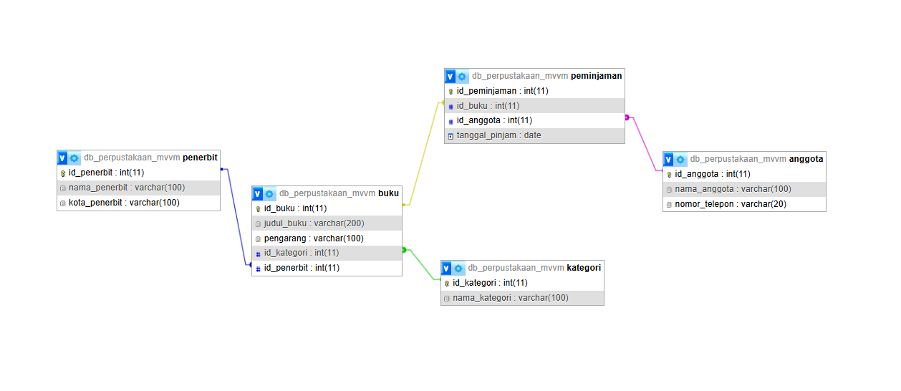

# Tugas Praktikum 11 - Model View ViewModel (TP10DPBO2425C1)

Saya **Mochammad Azka Basria** dengan NIM **2405170** mengerjakan Tugas Praktikum 11 dalam mata kuliah Desain Pemrograman Berorientasi Objek untuk keberkahan-Nya maka saya tidak akan melakukan kecurangan seperti yang telah dispesifikasikan. Aamiin.

_Repository_ ini merupakan implementasi pola arsitektur **MVVM (Model-View-ViewModel)** menggunakan bahasa **PHP Native** dengan tema **Sistem Manajemen Perpustakaan**. Program ini mendemonstrasikan pemisahan yang jelas antara logika bisnis, data, dan antarmuka pengguna, serta menerapkan konsep _Data Binding_ sederhana (Server-Side) dan operasi database CRUD (Create, Read, Update, Delete).

---

## Fitur Utama

### **Web App (PHP Native + Bootstrap)**

- **Manajemen Data Entitas:** CRUD lengkap untuk 5 entitas: Kategori, Penerbit, Anggota, Buku, dan Peminjaman.
- **Data Binding:** Sinkronisasi data antara View dan ViewModel, di mana form input otomatis terisi data saat mode edit (One-way & Two-way implementation via Request/Response).
- **Relasi Antar Tabel:** Implementasi _Foreign Key_ menggunakan _Dropdown List_ dinamis (misalnya memilih Penerbit saat menambah Buku).
- **Routing Sederhana:** Menggunakan satu titik masuk (`index.php`) untuk mengatur navigasi halaman.

---

## 🛠 Konsep MVVM & OOP pada Diagram

### 1. **Class & Object**

Sistem ini memiliki **11 kelas** utama yang terbagi dalam lapisan MVVM:

- **Config:** `Database`
- **Models (Entitas):** `Kategori`, `Penerbit`, `Anggota`, `Buku`, `Peminjaman`
- **ViewModels (Logika):** `KategoriViewModel`, `PenerbitViewModel`, `AnggotaViewModel`, `BukuViewModel`, `PeminjamanViewModel`

Masing-masing kelas berfungsi sebagai **blueprint**: Model merepresentasikan tabel database, sedangkan ViewModel menangani logika pertukaran data.

---

### 2. **Inheritance (Pewarisan)**

- Dalam implementasi PHP Native MVVM ini, pewarisan tidak digunakan secara ekstensif untuk hierarki entitas (seperti `Unit extends Entity`).
- Namun, prinsip pewarisan tetap ada pada sifat bawaan PHP di mana semua objek merupakan turunan dari _base object_ PHP, dan penggunaan `PDOException` yang mewarisi `Exception` untuk menangani error database.

---

### 3. **Composition (Komposisi)**

- `ViewModel` memiliki hubungan **komposisi** yang kuat dengan `Model` dan `Database`.
  - Contoh: `BukuViewModel` **memiliki** instance dari `Buku`, `Kategori`, dan `Penerbit`.
  - ViewModel tidak dapat bekerja tanpa adanya Model yang diinstansiasi di dalam constructor-nya.

---

### 4. **Aggregation (Agregasi)**

- `Buku` memiliki hubungan **agregasi** dengan `Kategori` dan `Penerbit`.
  - Buku membutuhkan Kategori, tetapi Kategori bisa berdiri sendiri tanpa Buku.
- `Peminjaman` memiliki hubungan **agregasi** dengan `Buku` dan `Anggota`.
  - Data transaksi peminjaman hanya merujuk pada ID Buku dan ID Anggota (Foreign Key).

---

### 5. **Constructor**

Setiap kelas menggunakan **constructor** untuk inisialisasi dependensi:

- `Database` menginisialisasi properti koneksi (`host`, `username`, dll).
- `Model` menerima objek koneksi database (`$db`) melalui constructor.
- `ViewModel` memanggil constructor `Database` untuk membuat koneksi, lalu mengoper koneksi tersebut saat membuat instance `Model`.

---

### 6. **Encapsulation (Enkapsulasi)**

- Atribut koneksi pada `Database` (`$host`, `$password`, dll) bersifat **private** untuk keamanan.
- Atribut internal pada `Model` (seperti `$conn` dan `$table_name`) bersifat **private**, sedangkan data entitas (seperti `$judul_buku`) bersifat **public** agar mudah diakses oleh Data Binding di View (atau bisa dibuat private dengan Getter/Setter).

---

### 7. **Separation of Concerns (Pemisahan Tugas)**

- Menggantikan Polimorfisme dalam konteks ini, MVVM menekankan pemisahan tugas:
  - **Model:** Hanya peduli pada Query SQL.
  - **View:** Hanya peduli pada HTML/Tampilan.
  - **ViewModel:** Jembatan yang menghubungkan keduanya.

---

### 8. **Array / List of Objects**

Hasil _fetching_ data dari database menggunakan `PDO::FETCH_ASSOC` yang menghasilkan sekumpulan data (List) yang kemudian diiterasi (looping) di dalam **View** untuk ditampilkan dalam bentuk tabel.

---

### Ilustrasi Diagram



---

## 📂 Struktur Proyek

```

.
├── config/
│ └── Database.php
├── database/
│ └── perpustakaan.sql
├── models/
│ ├── Anggota.php
│ ├── Buku.php
│ ├── Kategori.php
│ ├── Peminjaman.php
│ └── Penerbit.php
├── viewmodels/
│ ├── AnggotaViewModel.php
│ ├── BukuViewModel.php
│ ├── KategoriViewModel.php
│ ├── PeminjamanViewModel.php
│ └── PenerbitViewModel.php
├── views/
│ ├── template/
│ │ ├── header.php
│ │ └── footer.php
│ ├── anggota_form.php
│ ├── anggota_list.php
│ ├── buku_form.php
│ ├── buku_list.php
│ ├── kategori_form.php
│ ├── kategori_list.php
│ ├── peminjaman_form.php
│ ├── peminjaman_list.php
│ ├── penerbit_form.php
│ └── penerbit_list.php
├── index.php
└── README.md

```

---

## 📌 Desain dan Alur Kerja

### **Desain Class (Sampel Utama)**

- **`Database` (Config):**

  - **Method:** `getConnection()` mengembalikan objek PDO.

- **`Buku` (Model):**

  - **Atribut:** `id_buku`, `judul_buku`, `pengarang`, `id_kategori`, `id_penerbit`.
  - **Method:** `read()` (Join Query), `create()`, `getSingleBuku()`, `update()`, `delete()`.

- **`BukuViewModel` (ViewModel):**
  - **Atribut:** `$model` (Buku), `$kategoriModel`, `$penerbitModel`.
  - **Method:**
    - `viewList()`: Mengambil data buku.
    - `getKategoriList()` & `getPenerbitList()`: Untuk isi dropdown.
    - `addBuku(...)`, `updateBuku(...)`, `deleteBuku(...)`: Logika manipulasi data.

### **Alur Kerja**

1.  **Request:** User mengakses URL (misal: `index.php?page=buku`).
2.  **Routing:** `index.php` mengecek parameter `page` dan memanggil file View yang sesuai (`views/buku_list.php`).
3.  **ViewModel Initialization:** Di dalam View, `BukuViewModel` diinstansiasi. Constructor ViewModel membuka koneksi database.
4.  **Data Fetching:** View memanggil method `viewList()` dari ViewModel. ViewModel meminta Model (`Buku::read()`) mengeksekusi Query SQL.
5.  **Rendering:** Data dikembalikan ke View dan ditampilkan menggunakan HTML & Bootstrap table.
6.  **Data Binding (Form):** Saat user mengedit, `getBukuById($id)` dipanggil. Data dari Model langsung di-_bind_ ke `value` input HTML.

---

# Dokumentasi Program (Video)

<video controls src="dokumentasi/2025-12-02 08-59-19.mp4" title="Title"></video>
